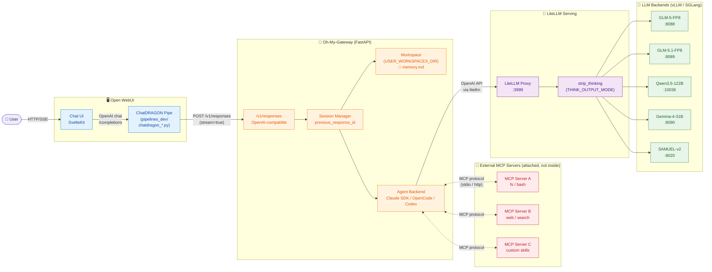
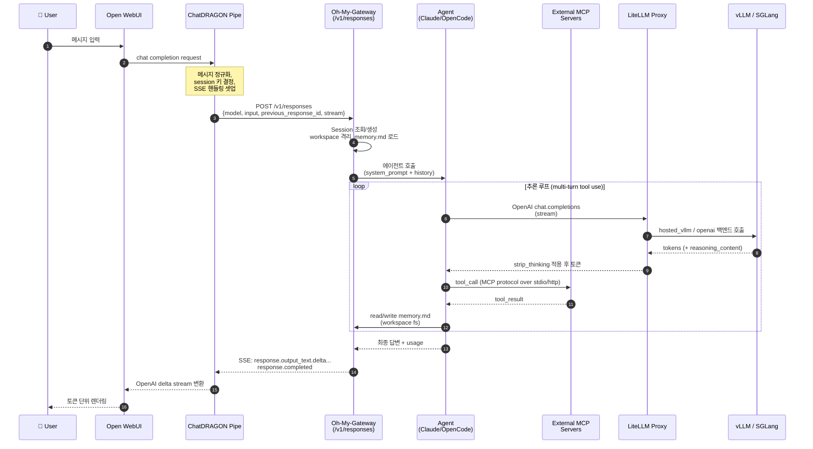
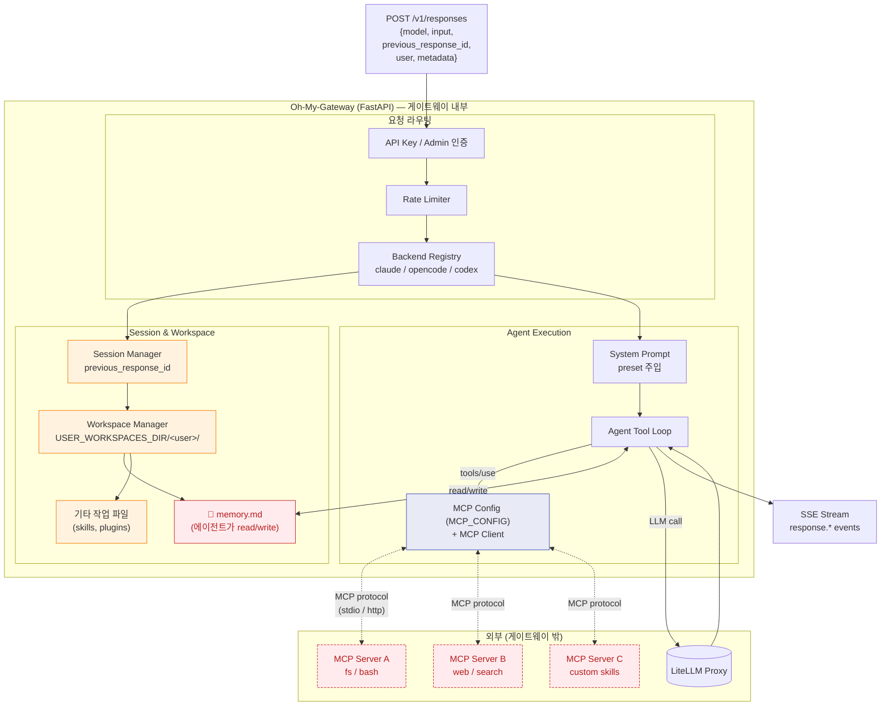
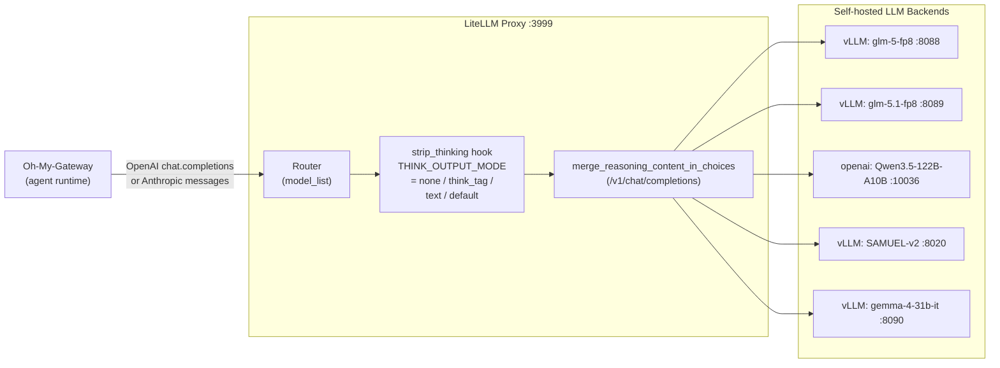
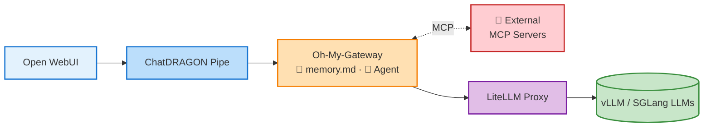

# ChatDRAGON Pipeline Architecture

발표용 다이어그램 토대 문서입니다. GitHub 에서 Mermaid 가 렌더링되며, 슬라이드에 캡쳐해 사용해도 됩니다.

전체 흐름 한 줄 요약:

> **User → Open WebUI → ChatDRAGON Pipe → Oh-My-Gateway (Agent + memory.md) ↔ External MCP Servers / → LiteLLM Proxy → vLLM/SGLang LLM**

MCP 서버는 게이트웨이에 *붙는* 외부 프로세스이지, 게이트웨이 내부 모듈이 아닙니다.

---

## 1. High-Level Overview

### Mermaid (GitHub 라이브 렌더)

### SVG (슬라이드/발표용 정적 이미지)

> 위 Mermaid 소스를 mermaid-cli 로 렌더링한 SVG 입니다. 슬라이드에 그대로 쓰거나 PNG 로 변환해 사용하세요. 파일: [`docs/images/pipeline-highlevel.svg`](images/pipeline-highlevel.svg)

---

## 2. End-to-End Request Sequence

한 번의 사용자 메시지가 토큰 스트림으로 돌아오기까지의 과정.

---

## 3. Component Responsibilities

| 레이어 | 레포 | 역할 | 주요 파일 |
|---|---|---|---|
| Frontend / Chat UI | `kyutinium/open-webui` | 사용자 입출력, 채팅 UX, 모델 셀렉터 | `src/`, `backend/` |
| Pipe (어댑터) | `kyutinium/open-webui` | OpenAI Chat ↔ Responses API 변환, SSE 핸들링, 세션 키 매핑 | `pipelines_dev/chatdragon_*.py` |
| Gateway | `jiny0ung-shin/oh-my-gateway` | `/v1/responses` 표준화, 세션/워크스페이스/MCP 클라이언트/에이전트 백엔드 라우팅 | `src/main.py`, `src/session_manager.py`, `src/workspace_manager.py`, `src/mcp_config.py`, `src/backends/` |
| Agent Backend | `kyutinium/opencode` (+ Claude Agent SDK) | 도구 사용 루프, 코딩 에이전트 실행 | OpenCode CLI / Claude SDK |
| Memory | gateway workspace | 대화/세션 단위 영속 메모리 (게이트웨이가 마운트하는 fs) | `working_dir/<session>/memory.md` |
| **MCP Servers (외부)** | 각 MCP 구현체 (별도 프로세스) | 게이트웨이/에이전트가 클라이언트로서 연결하는 외부 도구 서버 | stdio 서브프로세스 또는 HTTP endpoint |
| Model Proxy | `kyutinium/litellm_serving` | OpenAI/Anthropic 호환 라우팅, reasoning 후처리 | `litellm_config.yaml`, `strip_thinking.py` |
| LLM Serving | (vLLM / SGLang 인스턴스) | 실제 토큰 생성 | 포트별 모델 서버 |

---

## 4. Inside Oh-My-Gateway

게이트웨이 내부 구조와 외부에 붙는 MCP 서버의 관계입니다. **MCP 서버 자체는 게이트웨이 외부 프로세스**이고, 게이트웨이 안에는 그것을 가리키는 *config* 와 *MCP client* 만 있습니다.

핵심 포인트:

- **세션 연속성**: `previous_response_id` 로 동일 세션의 multi-turn 을 잇는다. 다른 백엔드 혼용은 거부.
- **워크스페이스 격리**: 기본은 임시 세션 디렉토리, `USER_WORKSPACES_DIR` 설정 시 사용자별 디렉토리.
- **memory.md**: 워크스페이스 안의 평범한 파일이지만, 시스템 프롬프트/스킬이 "장기 기억" 으로 사용하도록 가이드한다. 에이전트가 매 턴 자연스럽게 read/write.
- **MCP 는 외부 프로세스**: 게이트웨이는 `MCP_CONFIG` 만 들고 있고, 실제 도구는 stdio 서브프로세스 또는 별도 HTTP endpoint 로 떠있는 외부 MCP 서버. OpenCode 매니지드 모드에선 `opencode serve` 의 MCP 설정도 게이트웨이가 자동 생성해 넘긴다.

---

## 5. LiteLLM Serving Detail

| 모드 | thinking 처리 | 용도 |
|---|---|---|
| `none` (기본) | thinking 콘텐츠 제거 | 운영 — 깔끔한 응답만 |
| `think_tag` | `<think>...</think>` 로 감싸 출력 | UI 에서 접고 펼 때 |
| `text` | 평문으로 출력 | 디버깅/로깅 |
| `default` | LiteLLM 원본 동작 | 호환성 검증 |

---

## 6. Why Three Layers? (발표 포인트)

1. **Open WebUI 만으론 부족한 이유**
   - WebUI 는 OpenAI Chat Completions 클라이언트일 뿐, 에이전트/세션/도구 사용을 모른다.
   - Pipe 로 추상화 레이어를 끼워 Responses API 와 SSE 이벤트를 정상 파이프라인화.

2. **Oh-My-Gateway 가 하는 일**
   - 멀티 백엔드(Claude SDK / OpenCode / Codex)를 하나의 `/v1/responses` 로 통일.
   - 사용자별 워크스페이스 + `memory.md` 로 "기억 가진 에이전트" 구현.
   - **외부 MCP 서버를 client 로 연결**해 코딩/검색/파일 등 도구 실행을 위임. (MCP 서버는 떼었다 붙였다 가능한 외부 컴포넌트)
   - 어드민/사용량/세션 관측 → 운영 가능한 형태.

3. **LiteLLM 이 분리된 이유**
   - 자체 호스팅한 vLLM/SGLang 모델을 OpenAI/Anthropic 표준 API 로 노출.
   - reasoning(`<think>`) 후처리 정책을 한 군데서 통제.
   - 모델 추가/교체가 게이트웨이/웹UI 에 영향 없이 가능.

---

## 7. Slide-Ready One-Liner

---

## Repo Map

| 컴포넌트 | 레포 | 진입점 |
|---|---|---|
| Open WebUI (UI + Pipe 호스팅) | `Kyutinium/open-webui` | `pipelines_dev/chatdragon_responses.py` |
| ChatDRAGON 정의/도큐 | `Kyutinium/ChatDRAGON` | — |
| Gateway | `JinY0ung-Shin/oh-my-gateway` | `src/main.py` (`/v1/responses`), `src/mcp_config.py` |
| OpenCode 백엔드 | `Kyutinium/opencode` | OpenCode CLI |
| LiteLLM | `Kyutinium/litellm_serving` | `litellm_config.yaml` |
| MCP Servers | (외부 — 각 도구별 구현) | stdio/http endpoints, gateway `MCP_CONFIG` 에 등록 |
